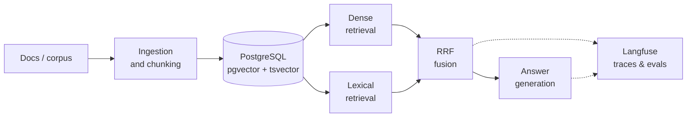

## 🔭 About me

AI Engineer working through the full LLM engineering ladder — **prompt engineering in production first, retrieval-augmented generation now, fine-tuning next**.
Whatever the layer, I build the complete path: data model, retrieval, serving API, observability, deploy.
Backend foundations in **Java/Spring and Python**, so the systems I build are boring where they must be, and smart where it counts.

- ✅ **Shipped:** LLM-powered support microservice on the ATM platform — Google Gemini, system-prompt design, session & context handling
- 🔨 **Now building:** [HybridRAG](https://github.com/nicola-palo/HybridRAG) — hybrid retrieval (dense + lexical + RRF) on a single PostgreSQL store
- 🔜 **Next:** first fine-tuning project, starting as soon as HybridRAG ships
- 📫 **Reach me:** [LinkedIn](https://linkedin.com/in/nicolapieropalo) · nicolapiero.palo@gmail.com

## 🚀 The LLM engineering arc

One platform (ATM), one ladder: each project climbs a step of LLM engineering.

| Step | Status | Project | What it proves |
|------|--------|---------|----------------|
| **Prompt engineering** | ✅ shipped | [ATM chat-support](https://github.com/nicola-palo/be.chatBancomat.python) | System-prompt design (`config.py`), context & session handling, Gemini 2.0 Flash inside a production microservice |
| **RAG** | 🔨 in progress | [HybridRAG](https://github.com/nicola-palo/HybridRAG) | Dense + lexical retrieval fused with RRF on one PostgreSQL store — CI included |
| **Fine-tuning** | 🔜 next | — | Launching right after HybridRAG — watch this space |

### 🔨 Current chapter: HybridRAG

**Hybrid retrieval-augmented generation (dense + lexical + RRF fusion) on a single PostgreSQL store.**
One database does it all: embeddings, full-text, metadata — no extra vector DB to operate.

➡️ **[github.com/nicola-palo/HybridRAG](https://github.com/nicola-palo/HybridRAG)** — work in progress

## 🧩 Featured work

| | Project | What it is |
|---|---------|------------|
| 🏧 | [**ATM microservices system**](https://github.com/nicola-palo/be.bancomat.java) | Full ATM platform across three services: [React front end](https://github.com/nicola-palo/fe.bancomat.react) + [Java/Spring core](https://github.com/nicola-palo/be.bancomat.java) + [FastAPI chat-support with Gemini AI](https://github.com/nicola-palo/be.chatBancomat.python), each with its own database, deployed on Render |
| 🧠 | [**atm-node**](https://github.com/nicola-palo/atm-node) | Python service node of the ATM platform |
| 🧩 | [**antigravityVSplug-in**](https://github.com/nicola-palo/antigravityVSplug-in) | VS Code extension integrating Antigravity directly into the IDE |

## 🛠 Stack

**AI & RAG**

**Engineering foundations**

## 📊 GitHub stats

  
  

<!-- 🐍 SNAKE — attiva questa sezione SOLO dopo il primo run dell'action (vedi ISTRUZIONI.md, passo 4):
<picture>
  <source media="(prefers-color-scheme: dark)" srcset="https://raw.githubusercontent.com/nicola-palo/nicola-palo/output/github-contribution-grid-snake-dark.svg"/>
  
</picture>
-->

## 📫 Contact

